<p align="center">
  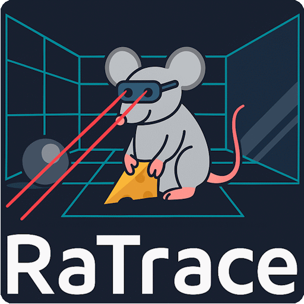
</p>

<p align="center">
  A 2D raytracer with a easy-to-use graphical user interface, written in Python.
</p>

---

[](https://coff.ee/stelejaci)
[](https://www.gnu.org/licenses/gpl-3.0)

<p><i>!! Disclaimer !! Mind you that this is very much a work-in-progress. This started as a personal hobby project and I never had the intent to release this publicly.
The code is in many places sub-optimal and buggy, but it works for my intent of use. Ok ... most of the time ... in Windows.</i></p>

---

## Table of contents
* [Overview](#Overview)
* [Usage](#Usage)
* [Examples](#Examples)
* [GUI](#GUI)
* [Syntax](#Syntax)

---

## Overview

<p align="center"> 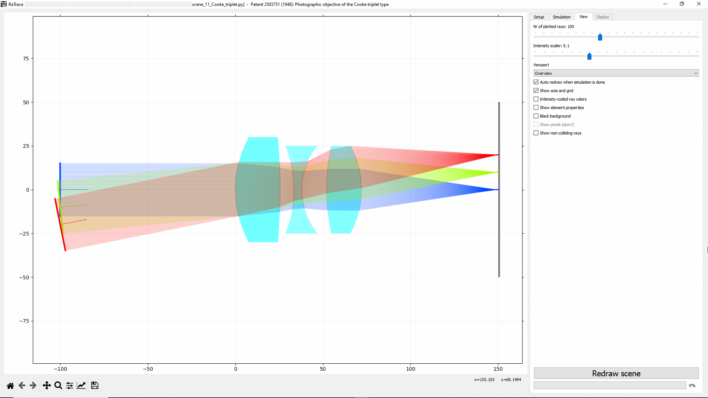 </p>

<b>Implemented features</b>
* GUI for 2D raytracing
* Scene creation via Python scripts
* Simulation of static scenes, with or without UI
* Automated scripts for looped simulations with different scenes
* Exact raytracing for analytically described elements (spherical, parabolic, flat surfaces)
* Accurate raytracing for segments-based, more "complex" elements
* "Fast" raytrace mode for ordered elements or "slow" mode for full raytracing
* Wavelength dispersion
* Tracking of ray phase information
* Export ray information to a text file
* Color coding rays: wavelength, rainbow, fixed, intensity-scaling
* Support for:
  * Light sources: point source, diffusing plane source, parallel plane source, laser source, virtual rays, double coherent point source
  * Glass elements: spherical lens, ideal lens, glass slab, prism, filter
  * Mirrors: flat, parabolic, semi-transparant
  * Surfaces: black absorber, diffuse scattering plane
  * Targets: display surface, imager

<b>To be implemented features</b>
* Glass elements: plano-convex lens, biprism, microlens array, asphere
* Light source: B/W image source
* Better error handling when scene is faulty
* Diffuse scattering sphere
* Glass materials library
* Multi-node surfaces instead of simple lines
* Show a list of elements (properties) in the UI
* Edit elements in the UI itself

<b>Known bugs</b>
* First screenshot in looped gui does not set the axis correctly
* Warning concerning colors
* Many others ...

<p align="center">
  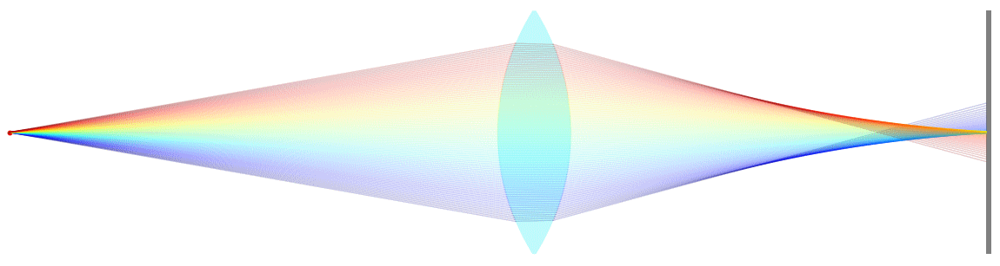
</p>

---

## Usage

Just download the files, and run one of the "main_XXX.py" files

There are 4 ways to run RaTrace:
* The primary way to use RaTrace is with the GUI. This way most of the settings can be changed, and new scenes can be loaded:
``` python main_GUI.py```
* With a GUI but automated and the possibility for taking screenshots. The program is closed when finished.
``` python main_GUI_in_loop.py```
* Without GUI, the program finishes when finished.
``` python main_noGUI.py```
* Without GUI but automated, the program finishes when finished.
``` python main_noGUI_in_loop.py```

When using the primary way-of-use via the GUI, the scene that is loaded is described in the config.ini file. 
Also, most of the options that are available in the GUI can also be set in the same config.ini file.

``` 
[scenes]
scene_file = scene.py
scenes_folder = D:/RaTrace/scenes
load_scene_at_startup = 1
start_simulation_after_loading_scene = 1
reset_axis_after_loading_scene = 0

[simulation]
nr_of_rays = 1000
use_phase_information = 1
generate_reflected_rays = 0
items_are_ordered = 0
export_folder = ../
add_timestamp_to_export_file = 1
exit_after_run = 1

[view]
show_axis_and_grid = 1
black_background = 0
nr_of_rays_to_plot = 100
show_elements_properties = 0
intensity_coded_colors = 0
show_pixels = 0
intensity_scaler = 0.1
show_noncolliding_rays = 1
splash_screen_transition = 0
```

The scenes itself are written in Python and are dynamically loaded whenever a new scene is loaded. See the next chapter for examples.

### Note:
The standard units for calculations in RaTrace are <b>mm</b> and <b>radians</b>. For ease-of-use you can import and use other units from the utils.vara module in the following way:
```
from utils.varia import mm, nm, deg
wavelength_mm = 660*nm
angle_radians = 30*deg
```

---

## Examples

I invite u to browse and try out the different example scenes that are available in the scenes folder.

### Simple on-axis lens
Below you find the content of a very simple scene file. 
First, all the modules used in the scene are imported. Next the ```load_scene``` module must always be present and contains all necessary elements, in this case a point light, an ideal lens and a beam dump to receive the rays:
```
import numpy as np
from utils.varia import mm,nm, deg
from utils.optics import N_glass
from light import point_source_class
from elements import ideal_thin_lens_class, black_plate_class

def load_scene():
    light = point_source_class.PointSourceClass(p0=np.array([-15, 0]), n0=np.array([1,0]), wavelength=660*nm, fan_angle=30*deg)
    lens = ideal_thin_lens_class.IdealThinLensClass(p0=np.array([0,0]),  n0=np.array([-1,0]), f=10*mm, diameter=10*mm, N=N_glass)
    beam_dump = black_plate_class.BlackPlateClass(p0=np.array([30, 0]), n0=np.array([-1,0]), length=10*mm)
    info = 'Ideal lens projecting a point source'
    return [light, lens, beam_dump, info]
```

When the simulation is run in the GUI, this results in the following (clipped) screenshot:   

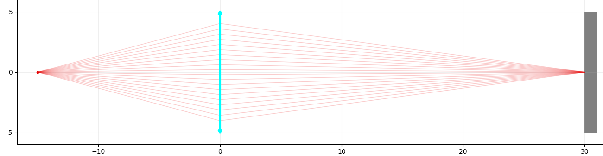

### Chromatic aberration
In this example I ony show what's essential in the load_scene module and skip all boilerplate code before and after this section:
```
beam_red  = plane_source_class.PlaneSourceClass(p0=np.array([-20,0]), n0=np.array([1,0]),  diameter=20*mm, wavelength=660*nm, intensity_distribution='equidistant', plot_color='wavelength')
beam_green = plane_source_class.PlaneSourceClass(p0=np.array([-20,0.2]), n0=np.array([1,0]),  diameter=20*mm, wavelength=520*nm, intensity_distribution='equidistant', plot_color='wavelength')
beam_blue = plane_source_class.PlaneSourceClass(p0=np.array([-20,0.4]), n0=np.array([1,0]),  diameter=20*mm, wavelength=450*nm, intensity_distribution='equidistant', plot_color='wavelength')
lens = spherical_lens_class.SphericalLensClass (p0=np.array([0,  0]), n0=np.array([-1,0]), thickness=5*mm, f=40*mm, diameter=25 * mm, N=[1.7, 0.05])
beam_dump = black_plate_class.BlackPlateClass(  p0=np.array([40, 0]), n0=np.array([-1,0]), length=20 * mm, thickness=1*mm)
```
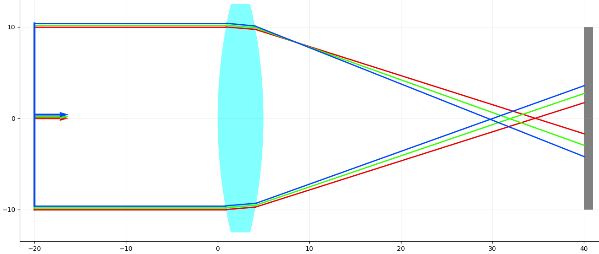

### Newtonian telescope
The list of elements in the load_scene module becomes a bit too long to show here, so please look at example 8 in the examples folder for details.

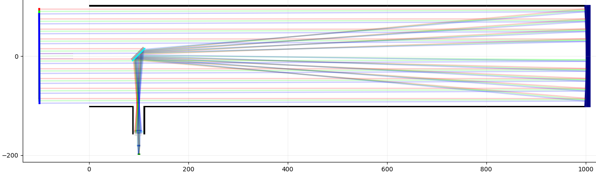

---

## GUI

The GUI has a rather limited number of controls to keep things simple (for now). The screenshot shown below is of a point light source, a spherical lens and an imager. The latter is because the display tab only enables when some sort of display is included in the scene. 
<p align="center">
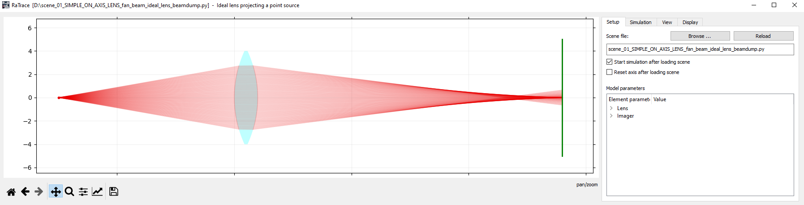
</p>

Most of the controls in the several tabs are self-explanatory, but we will give some clarification nevertheless:

### Setup
<p align="center">
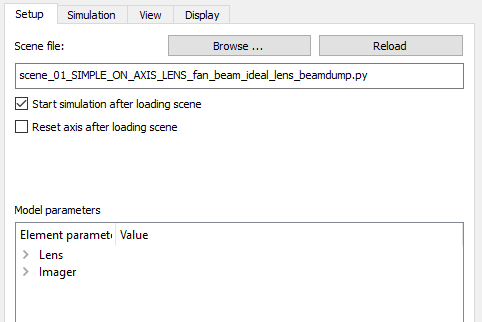
</p>

* <b>Browse / Reload -</b> This tab allow for loading scenes, as well as reloading scenes. The latter is handy when editing a scene file, and quickly viewing the results without the need to push the load-button and browse to the file over and over.
* <b>Start simulation after loading scene -</b> When a scene is loaded and this checkbox is enabled, the UI immediately starts simulating the scene when loaded. This also quickens the iterative process of scene editing.
* <b>Reset axis after loading scene -</b> Auto-zooms the scene to the entire scene space when a scene is loaded.
* ( <b>Model parameters - </b> Not yet implemented )

### Simulation
<p align="center">
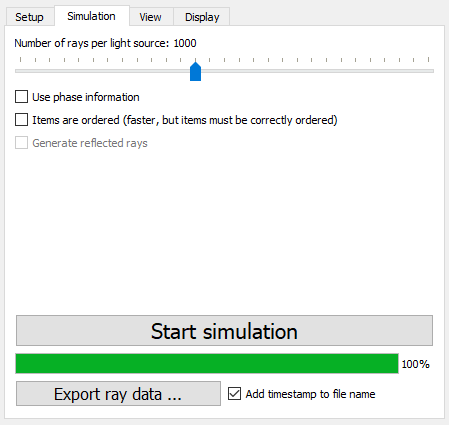
</p>

* <b>Number of rays - </b>The number of initial rays that is generated, per light source.
* <b>Use phase information - </b>Taking into account the phase information of the rays to generate an interfered image. This is only relevant when using an imager, since then the phase is integrated within the extent of a pixel.
* <b>Items are ordered - </b>When selecting this option, the raytracer checks the elements for collision with the rays in the order that was given in the scene file. If the optical path is "more complex", unselect this checkbox.
* <b>Start simulation - </b>you're a smart person, you can figure out what this button does.


### View
<p align="center">
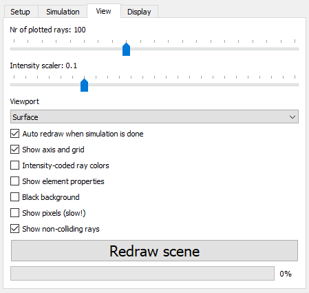
</p>

* <b>Number of plotted rays - </b>How much of the initially generated rays that are plotted. If each rays breaks down in multiple child-rays, this can quickly slow down the drawing process. It is advised to start low, and increase the number if required. This number can not be higher than the number of simulated rays.   
* <b>Intensity scaler - </b>A slider that can dim down or enhance the intensity of rays. 
* ( <b>Viewport - </b>Not yet implemented )
* <b>Auto redraw - </b>When a simulation finishes, the entire scene is automatically redrawn when enabled.
* <b>Show axis and grid - </b>Show or hide the axis and grid
* <b>Intensity-coded ray colors - </b>When enabled the transparency of plotted rays scales with their intensity  
* <b>Show element properties - </b>Draws the element's name and properties
* <b>Black background - </b>Show a black instead of white background. Usefull for dark-themed presentations, or in some cases the rays display better with a black background.
* <b>Show pixels - </b>When enabled, this shows the center and extent of all pixels of an imager. This could slow down the plotting process when the imager has many pixels.
* <b>Show non-colliding rays - </b>Show/hide rays that do not collide with any of the elements. Useful to speed up the plotting process or declutter the image in some cases.

Note that the intensity and line width of plotted rays automatically scales up or down with the number of plotted rays. 

### Display
<p align="center">
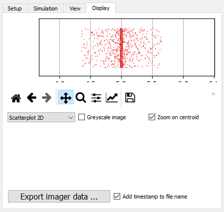
</p>

#### Display modes
<p align="center">
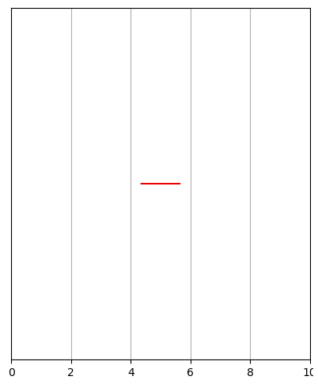
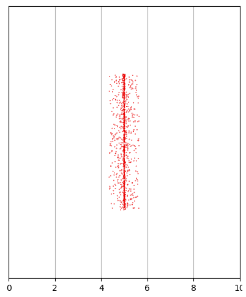
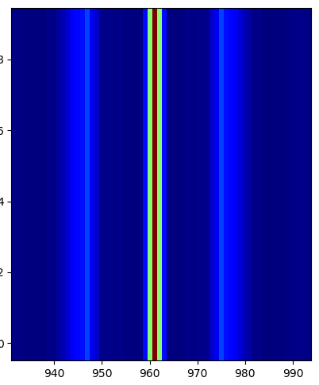
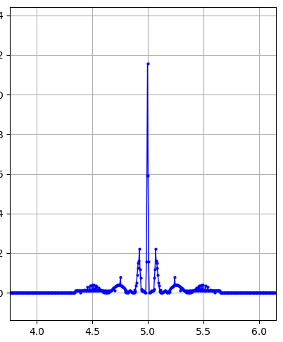
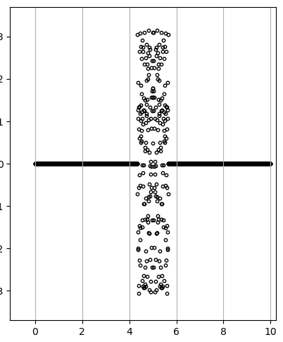
</p>

---

## Syntax


### Light sources

#### Point source

#### Parallel plane source

#### Diffuse plane source

#### Laser

#### Virtual ray


### Glass elements

#### Ideal (thin) lens

#### Ideal thick lens

#### Spherical lens


### Surfaces

#### Diffuse plate

#### Diffuse sphere


### Mirrors

#### Flat mirror

#### Semi-transparent mirror

#### Parabolic mirror

#### Black plate (Beam dump)


### Targets

#### Display

#### Imager
