<p align="center">
  
</p>

<p align="center">
  A 2D raytracer with a easy-to-use graphical user interface, written in Python.
</p>

---

[](https://coff.ee/stelejaci)
[](https://www.gnu.org/licenses/gpl-3.0)

<p><i>!! Disclaimer !! Mind you that this is very much a work-in-progress. This started as a personal hobby project and I never had the intent to release this publicly.
The code is in many places sub-optimal and buggy, but it works for my intent of use. Ok ... most of the time ... in Windows.</i></p>

The information in this README will later be formatted into a Wiki page of this project. But for the time being I'll just put it all in this one extensive document.

---

## Table of contents
* [Overview](#Overview)
* [Usage](#Usage)
* [Examples](#Examples)
* [GUI](#GUI)
* [Syntax](#Syntax)

---

## Overview

<p align="center">  </p>

<b>Implemented features</b>
* GUI for 2D raytracing
* Scene creation via Python scripts
* Simulation of static scenes, with or without UI
* Automated scripts for looped simulations with different scenes
* Exact raytracing for analytically described elements (spherical, parabolic, flat surfaces)
* Accurate raytracing for segments-based, more "complex" elements
* "Fast" raytrace mode for ordered elements or "slow" mode for full raytracing
* Wavelength dispersion
* Tracking of ray phase information
* Export ray information to a text file
* Color coding rays: wavelength, rainbow, fixed, intensity-scaling
* Support for:
  * Light sources: point source, diffusing plane source, parallel plane source, laser source, virtual rays, double coherent point source
  * Glass elements: spherical lens, ideal lens, glass slab,
  * Mirrors: flat, parabolic, semi-transparent
  * Surfaces: black absorber, aperture, diffuse scattering plane
  * Targets: display surface, imager

<b>To be implemented features (& priority)</b>
* Lenses: plano-convex lens (1), aspherical lens (4)
* Glass elements: sphere, prism (2), biprism, microlens array 
* Mirrors: spherical mirror, one-way mirror, dichroic mirror
* Light source: B/W image source
* Varia: Bandpass filter
* Internal & total reflections (3)
* Better error handling when there is a bug in the scene
* Diffusely scattering sphere
* A library of glass materials
* Glass dispersion described with Abbe numbers
* Multi-node surfaces instead of simple lines
* Show a list of elements (properties) in the UI
* Edit elements in the UI itself

<b>Known bugs</b>
* First screenshot in looped gui does not set the axis correctly
* Warning concerning colors
* Contact surfaces (e.g. lens doublet) not working
* Crash when selecting an intensity plot in the display tab, when no imager is present 
* Many others ...

<p align="center">
  
</p>

---

## Requirements

### Python Version

* Python 3.7 or higher

### Libraries

The following libraries were used:

* PyQt5 = 5.15.11
* numpy = 2.1.3
* matplotlib = 3.9.2

## Usage

There are 4 ways to run RaTrace:
1) The primary way to use RaTrace is with the GUI. This way most of the settings can be changed, and new scenes can be loaded:

``` python main_GUI.py```

2) With a GUI but automated and the possibility for taking screenshots. Each time a simulation in the loop is finished, the GUI closes and the next iteration starts.

``` python main_GUI_in_loop.py```

3) Running simulations without a GUI, with the possibility to export ray data to a text file when the simulation is finished.

``` python main_noGUI.py```

4) The same GUI-less approach, but running in a loop

``` python main_noGUI_in_loop.py```

When using the primary way-of-use via the GUI, the scene that is loaded is described in the config.ini file. 
Also, most of the options that are available in the GUI can also be set in the same config.ini file.

``` 
[scenes]
scene_file = scene_01_SIMPLE_ON_AXIS_LENS_fan_beam_ideal_lens_beamdump.py
scenes_folder = ..\scenes
load_scene_at_startup = 1
start_simulation_after_loading_scene = 1
reset_axis_after_loading_scene = 1

[simulation]
nr_of_rays = 10
use_phase_information = 0
generate_reflected_rays = 0
items_are_ordered = 0
export_folder = ../
add_timestamp_to_export_file = 1
exit_after_run = 1

[view]
show_axis_and_grid = 1
black_background = 0
nr_of_rays_to_plot = 100
show_elements_properties = 0
intensity_coded_colors = 1
show_pixels = 0
intensity_scaler = 1
show_noncolliding_rays = 1
splash_screen_transition = 2
```

The scenes itself are written in Python and are dynamically loaded whenever a new scene is loaded. See the next chapter for examples.

---

## Examples

I invite u to browse and try out the different example scenes that are available in the scenes folder.

### Simple on-axis lens
Below you find the content of a very simple scene file. 
First, all the modules used in the scene are imported. Next the ```load_scene``` module must always be present and contains all necessary elements, in this case a point light, an ideal lens and a beam dump to receive the rays:
```
import numpy as np
from utils.varia import mm,nm, deg
from utils.optics import N_glass
from light import point_source_class
from elements import ideal_thin_lens_class, black_plate_class

def load_scene():
    light = point_source_class.PointSourceClass(p0=np.array([-15, 0]), n0=np.array([1,0]), wavelength=660*nm, fan_angle=30*deg)
    lens = ideal_thin_lens_class.IdealThinLensClass(p0=np.array([0,0]),  n0=np.array([-1,0]), f=10*mm, diameter=10*mm, N=N_glass)
    beam_dump = black_plate_class.BlackPlateClass(p0=np.array([30, 0]), n0=np.array([-1,0]), length=10*mm)
    info = 'Ideal lens projecting a point source'
    return [light, lens, beam_dump, info]
```

When the simulation is run in the GUI, this results in the following (clipped) screenshot:   


### Chromatic aberration
In this example I ony show what's essential in the load_scene module and skip all boilerplate code before and after this section:
```
beam_red  = plane_source_class.PlaneSourceClass(p0=np.array([-20,0]), n0=np.array([1,0]),  diameter=20*mm, wavelength=660*nm, intensity_distribution='equidistant', plot_color='wavelength')
beam_green = plane_source_class.PlaneSourceClass(p0=np.array([-20,0.2]), n0=np.array([1,0]),  diameter=20*mm, wavelength=520*nm, intensity_distribution='equidistant', plot_color='wavelength')
beam_blue = plane_source_class.PlaneSourceClass(p0=np.array([-20,0.4]), n0=np.array([1,0]),  diameter=20*mm, wavelength=450*nm, intensity_distribution='equidistant', plot_color='wavelength')
lens = spherical_lens_class.SphericalLensClass (p0=np.array([0,  0]), n0=np.array([-1,0]), thickness=5*mm, f=40*mm, diameter=25 * mm, N=[1.7, 0.05])
beam_dump = black_plate_class.BlackPlateClass(  p0=np.array([40, 0]), n0=np.array([-1,0]), length=20 * mm, thickness=1*mm)
```


### Newtonian telescope
The list of elements in the load_scene module becomes a bit too long to show here, so please look at example 8 in the examples folder for details.


---

## GUI

The GUI has a rather limited number of controls to keep things simple (for now). Most of the controls in the several tabs are self-explanatory, but we will give some clarification nevertheless:

### Setup

<p align="center">

</p>

* <b>Browse / Reload -</b> This tab allow for loading scenes, as well as reloading scenes. The latter is handy when editing a scene file, and quickly viewing the results without the need to push the load-button and browse to the file over and over.
* <b>Start simulation ... -</b> When a scene is loaded and this checkbox is enabled, the UI immediately starts simulating the scene when loaded. This also quickens the iterative process of scene editing.
* <b>Reset axis ... -</b> Auto-zooms the scene to the entire scene space when a scene is loaded.
* ( <b>Model parameters - </b> Not yet implemented )

### Simulation

<p align="center">

</p>

* <b>Number of rays ... - </b>The number of initial rays that is generated, per light source.
* <b>Use phase information - </b>Taking into account the phase information of the rays to generate an interfered image. This is only relevant when using an imager, since then the phase is integrated within the extent of a pixel.
* <b>Items are ordered ... - </b>When selecting this option, the raytracer checks the elements for collision with the rays in the order that was given in the scene file. If the optical path is "more complex", unselect this checkbox.
* <b>Start simulation - </b>you're a smart person, you can figure out what this button does.
* <b>Export ray data - </b>Export all ray data to a structured ascii-file.
* <b>Add timestamp ... - </b>Add or omit a timestamp to the export file name.


### View

<p align="center">

</p>

* <b>Number of plotted rays - </b>How much of the initially generated rays that are plotted. If each rays breaks down in multiple child-rays, this can quickly slow down the drawing process. It is advised to start low, and increase the number if required. This number can not be higher than the number of simulated rays.   
* <b>Intensity scaler - </b>A slider that can dim down or enhance the intensity of rays. 
* ( <b>Viewport - </b>Not yet implemented )
* <b>Auto redraw - </b>When a simulation finishes, the entire scene is automatically redrawn when enabled.
* <b>Show axis and grid - </b>Show or hide the axis and grid
* <b>Intensity-coded ray colors - </b>When enabled the transparency of plotted rays scales with their intensity  
* <b>Show element properties - </b>Draws the element's name and properties
* <b>Black background - </b>Show a black instead of white background. Usefull for dark-themed presentations, or in some cases the rays display better with a black background.
* <b>Show pixels - </b>When enabled, this shows the center and extent of all pixels of an imager. This could slow down the plotting process when the imager has many pixels.
* <b>Show non-colliding rays - </b>Show/hide rays that do not collide with any of the elements. Useful to speed up the plotting process or declutter the image in some cases.
* <b>Redraw scene - </b>Guess what?

Note that the intensity and line width of plotted rays automatically scales up or down with the number of plotted rays. 

### Display

<p align="center">

</p>

The display tab is only enabled when there is a display or an imager present in the scene. The graph in this tab shows the impact points of the rays with the display, in various ways. 

#### Display graph modes

* <b>Scatterplot 1D : </b>The intersection points of the rays with the display, shown in 1D
* <b>Scatterplot 2D : </b>The same as the 1D version, but shown in pseudo-2D, where each point gets a random vertical displacement. Useful for better visualisation. 
* <b>Intensity plot 1D : </b>Only works with pixel-based imagers. This graph shows the intensity registered in all the pixels of the 1D imager.
* <b>Intensity plot 2D : </b>Same as the 1D version, but shown as a pseudo-2D color image. 
* <b>Phase plot : </b>This too only works with imagers. This shows the phases of the rays at the intersection points, as well as the resulting phase.

<p align="center">


</p>


---

## Syntax

### Miscellaneous

#### Units

The standard units for calculations in RaTrace are <b>mm</b> and <b>radians</b>. For ease-of-use you can import and use other units from the utils.varia module in the following way:

```
from utils.varia import m, cm, mm, µm, nm, rad, deg
wavelength_mm = 660*nm
angle_radians = 30*deg
```

#### Refractive index

Refractive indices can be either imported from the optics module, or self defined.

```
from utils.optics import N_air, N_glass
```

 For materials that have dispersion, the refractive index can be described with the materials "principal dispersion values", i.e. the refractive index at the blue F line minus the refractive index at the red C line, and is typically a small number.

* No dispersion: N = 1.7
* With dispersion: N = [1.7, 0.05]

#### Colors

Colors can be described in a number of ways: 
* <b>(R,G,B,A)</b> : A 4-element tuple of 3 RGB values and a transparency (or alpha) value
* <b>'red', 'green', 'blue', ... </b> : A string describing the color 
* <b>'rainbow'</b> : The colors of the n initial rays are given by ordered n colors of the rainbow    
* <b>'wavelength'</b> : The color of rays is determined by their wavelength

### Light sources

The following object classes should be imported from the 'light' folder:

```
from light import point_source_class, plane_source_class, diffuse_plane_source_class, laser_class, virtual_ray_class
```

#### Directed point source

A directed point light source object with an origin, orientation and spread fan angle

<p align="center">
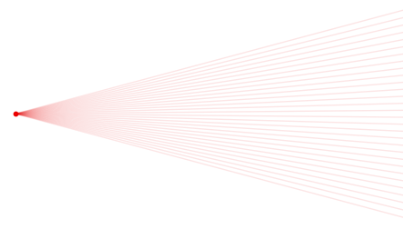
</p>

<i>Object initialisation:</i>
```
point_source_class.PointSourceClass(p0, n0, fan_angle wavelength, intensity, intensity_distribution, plot_color)
```

<i>Input parameters:</i>
* <b>p0</b> (np.array | default=np.array([0,0])) : Position of the point source
* <b>n0</b> (np.array | default=np.array([1,0])) : Direction of the point source 
* <b>fan_angle</b> (float | default=30*deg) : Fan angle of the cone of light
* <b>wavelength</b> (float | default=660*nm) : Wavelength of the light rays 
* <b>intensity</b> (float | default=1) : Intensity of the initial light rays
* <b>intensity_distribution</b>  ('equiangular', 'gaussian', 'gaussianrandom', 'random' | default='equiangular') : Intensity distribution of the rays along the light fan 
* <b>plot_color</b> (color | default='wavelength'): Plot color of the light rays

#### Parallel plane source

A directed parallel light source object with an origin, orientation and width

<p align="center">

</p>

<i>Object initialisation:</i>
```
plane_source_class.PlaneSourceClass(p0, n0, diameter, wavelength, intensity, intensity_distribution='equidistant', plot_color='wavelength')
```

<i>Input parameters:</i>
* <b>p0</b> (np.array | default=np.array([0,0])) : Position of the plane source
* <b>n0</b> (np.array | default=np.array([1,0])) : Direction of the plane source 
* <b>diameter</b> (float | default=10*mm) : Diameter, extent or size of the plane source
* <b>wavelength</b> (float | default=660*nm) : Wavelength of the light rays 
* <b>intensity</b> (float | default=1) : Intensity of the initial light rays
* <b>intensity_distribution</b>  ('equidistant', 'random' | default='equidistant') : Intensity distribution of the rays along the light fan 
* <b>plot_color</b> (color | default='wavelength'): Plot color of the light rays

#### Diffuse plane source

A directed diffuse parallel light source object with an origin, orientation, width and spread angle. The ray distribution along its diameter, as well as the ray orientation is random within the limits defined. The example below shows the situation for a 20° fan angle.

<p align="center">

</p>

<i>Object initialisation:</i>
```
plane_source_class.DiffusePlaneSourceClass(p0, n0, diameter, fan_angle, wavelength, intensity, intensity_distribution, plot_color)
```

<i>Input parameters:</i>
* <b>p0</b> (np.array | default=np.array([0,0])) : Position of the plane source
* <b>n0</b> (np.array | default=np.array([1,0])) : Direction of the plane source 
* <b>diameter</b> (float | default=10*mm) : Diameter, extent or size of the plane source
* <b>fan_angle</b> (float | default=30*deg) : Fan angle, or angular 'spread' of the rays in the cone of light
* <b>wavelength</b> (float | default=660*nm) : Wavelength of the light rays 
* <b>intensity</b> (float | default=1) : Intensity of the initial light rays
* <b>plot_color</b> (color | default='wavelength'): Plot color of the light rays

#### Laser

(To be documented) 

#### Virtual ray

(To be documented) 

### Glass elements

The following object classes should be imported from the 'light' folder:

```
from elements import ideal_thin_lens_class, spherical_lens_class, glass_element_class
```

#### Ideal (thin) lens

An ideal lens (perfect focus, no aberrations) with a certain focal distance f and diameter.

<p align="center">

</p>

<i>Object initialisation:</i>
```
ideal_thin_lens_class.IdealThinLensClass(p0, n0, f, diameter, N, blur_angle, nr_of_secondary_rays)
```

<i>Input parameters:</i>
* <b>p0</b> (np.array | default=np.array([10,0])) : Position of the plane source
* <b>n0</b> (float | default=np.array([-1,0])) : Orientation of the lens' optical axis
* <b>f</b> (float | default=100*mm) : Focal distance of the lens
* <b>diameter</b> (float | default=10*mm) : Diameter of the lens
* <b>N</b> (float | default=N_glass) : Refractive index of the lens
* <b>blur_angle</b> (float | default=0) : The angle over which rays are scattered when exiting the lens
* <b>nr_of_secondary_rays</b> (float | default=1) : The number of scattered rays

#### Spherical lens

A glass lens with focal distance f and spherical surfaces with radii R0 and R1. If f is given, the radii R0 and R1 are ignored (if provided) and calculated from f. In that case the lens is considered symmetrical, i.e. R0 and R1 are equal. If f is not given and R0 and R1 are, then f is calculated from the radii.

<p align="center">

</p>

<i>Object initialisation:</i>
```
spherical_lens_class.SphericalLensClass(p0, n0, R0, R1, f, thickness, diameter, N, blur_angle, nr_of_secondary_rays, plot_resolution)
```

<i>Input parameters:</i>
* <b>p0</b> (np.array([0,0]) : Position of the first surface of the lens
* <b>n0</b> (np.array([1,0]) : Orientation of the optical axis of the spherical lens
* <b>f</b> (float | default=None) : Focal distance
* <b>R0</b> (float | default=None) : The radius of the first surface 
* <b>R1</b> (float | default=None) : The radius of the second surface
* <b>thickness</b> (float | default=2*mm) : Thickness of the lens along the optical axis
* <b>diameter</b> (float | default=10*mm) : Diameter of the lens
* <b>N</b> (float | default=N_glass) : Refraction index
* <b>nr_of_secondary_rays</b> (float | default=1) : The number of secondary rays an outgoing ray generates
* <b>blur_angle</b> (float | default=0°) : The fan angle of the secondary rays
* <b>plot_resolution</b> (float | default=0.1*mm) : Resolution of the plotted lens shape

#### Glass parallel plate

<p align="center">

</p>


### Surfaces

Surfaces are imported from the elements folder:

```
from elements import diffuse_plate_class, black_plate_class
```

#### Diffuse scattering plate

A diffuse scattering surface scatters an incoming ray into a number of secondary rays, in a way defined by its bidirectional reflectance distribution function (BRDF). This BRDF is described by a diffuse scattering component with strength Kd and a specular component with strength Ks. The extent, or width, of the specular component is defined by the parameter alpha, according to the Blinn–Phong model.

The figures below show a single incoming ray (coming from the bottom left) casted onto a surface with BRDF parameters Kd=1, Ks=2, alpha=100. The peak of the plotted BRDF points in the reflected direction of the incoming ray. See example 10 for the implementation of the scene.   

<p align="center">
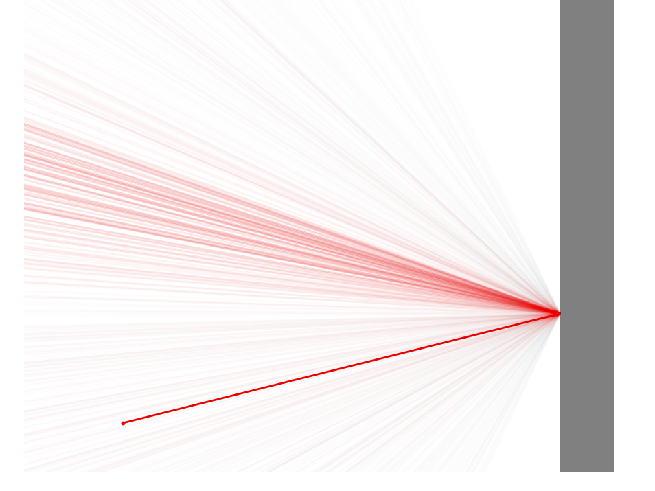
</p>

<i>Object initialisation:</i>
```
diffuse_plate_class.DiffusePlateClass(p0, n0, length, thickness, Kd=1, Ks, alpha, nr_of_scattered_rays, n_light)
```

<i>Input parameters:</i>
* <b>p0</b> (np.array | default=np.array([0,0])) : Position of the surface
* <b>n0</b> (np.array | default=np.array([-1,0])) : Orientation of the surface
* <b>length</b> (np.array | default=10*mm) : Length of the surface
* <b>thickness</b> (np.array | default=1*mm) : Thickness of the surface
* <b>Kd</b> (np.array | default=0) : Specular scattering component
* <b>Ks</b> (np.array | default=0) : Diffuse scattering component
* <b>alpha</b> (np.array | default=1) : Extent of the specular component
* <b>nr_of_scattered_rays</b> (np.array | default=1) : The number of secondary rays generated by each incoming ray
* <b>n_light</b>  (np.array | default=None) : An optional preferential direction of incoming light, only useful when plotting the BRDF in the reflected direction.

#### Black plate (Beam dump)

A black plate can be used as a beam dump, or for outlining light absorbing walls like lens tubes, telescopic tubes, etc. In the figure below, note that non-colliding rays are colored differently, IF at all (see "view" settings).

<p align="center">
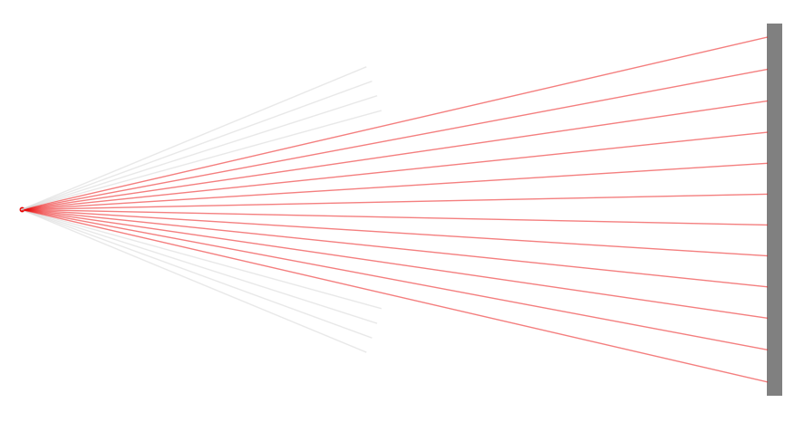
</p>

<i>Object initialisation:</i>
```
black_plate_class.BlackPlateClass(p0, n0, length, thickness, plot_color)
```

<i>Input parameters:</i>
* <b>p0</b> (np.array | default=np.array([0,0])) : Position of the plate
* <b>n0</b> (np.array | default=np.array([-1,0])) : Orientation of the plate
* <b>length</b> (float | default=10*mm) : Length of the plate
* <b>thickness</b> (float | default=1*mm) : Thickness of the plate
* <b>plot_color</b> (color | default=(0.5,0.5,0.5,1)): Plot color of the plate

#### Aperture

An aperture with an inner and outer diameter

<p align="center">
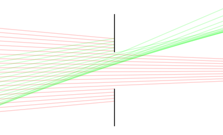
</p>

<i>Object initialisation:</i>
```
aperture_class.ApertureClass(p0, n0, diameter_inner, diameter_outer, plot_color)
```

<i>Input parameters:</i>
* <b>p0</b> (np.array | default=np.array([0,0])) : Position of the aperture
* <b>n0</b> (np.array | default=np.array([-1,0])) : Orientation of the aperture
* <b>diameter_inner</b> (float | default=10*mm) : Inner (passing) diameter of the aperture
* <b>diameter_outer</b> (float | default=20*mm) : Outer (blocking) diameter of the aperture
* <b>plot_color</b> (color | default=(0.5,0.5,0.5,1)): Plot color of the aperture


### Mirrors

Mirrors are imported from the elements folder:

```
from elements import flat_mirror_class, semi_transparent_mirror_class, parabolic_mirror_class
```

#### Flat mirror

A flat, fully reflecting mirror

<p align="center">
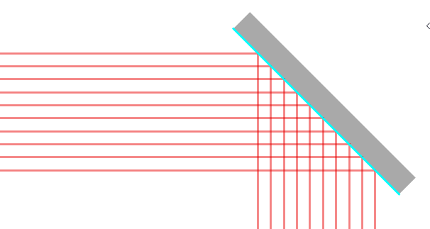
</p>

<i>Object initialisation:</i>
```
flat_mirror_class.FlatMirrorClass(p0, n0, length, thickness, plot_color)
```

<i>Input parameters:</i>
* <b>p0</b> (np.array | default=np.array([0,0])) : Position of the mirror
* <b>n0</b> (np.array | default=np.array([-1,0])) : Orientation of the mirror
* <b>length</b> (float | default=10*mm) : Length of the mirror
* <b>thickness</b> (float | default=1*mm) : Thickness of the mirror
* <b>plot_color</b> (color | default=(0,0,0.5,1)): Plot color of the mirror

#### Semi-transparent mirror

A semi-transparent mirror with a transmission coefficient

<p align="center">
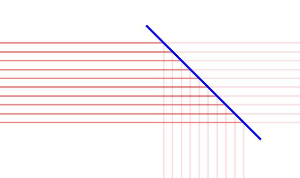
</p>

<i>Object initialisation:</i>
```
semi_transparent_mirror_class.SemiTransparentMirror(p0, n0, length, transmission)
```

<i>Input parameters:</i>
* <b>p0</b> (np.array | default=np.array([0,0])) : Position of the mirror
* <b>n0</b> (np.array | default=np.array([-1,0])) : Orientation of the mirror
* <b>length</b> (float | default=10*mm) : Length of the mirror
* <b>transmission</b> (float | default=0.5) : Transmission coefficient, 1-transmission represents the reflection coefficient

#### Parabolic mirror

A parabolic mirror with a focal distance and a diameter

<p align="center">
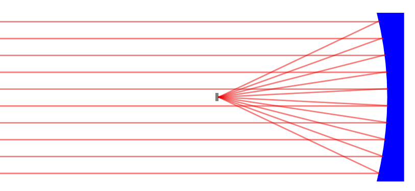
</p>

<i>Object initialisation:</i>
```
parabolic_mirror_class.ParabolicMirrorClass(p0, n0, f, diameter, thickness, plot_color)
```

<i>Input parameters:</i>
* <b>p0</b> (np.array | default=np.array([0,0])) : Position of the parabolic mirror
* <b>n0</b> (np.array | default=np.array([-1,0])) : Orientation of the parabolic mirror
* <b>f</b> (float | default=100*mm) : Focal distance
* <b>diameter</b> (float | default=100*mm) : Diameter of the mirror
* <b>thickness</b> (float | default=10*mm) : Thickness of the mirror
* <b>plot_color</b> (color | default=(0,0,0.5,1)): Plot color of the light rays
* <b>plot_resolution</b> (float | default=0.1*mm) : Resolution of the plotted mirror


### Displays

Displays are imported from the display folder:

```
from display import display_class, imager_class
```

#### Display

A display is a stopping surface for colliding rays. Contrary to black and other surfaces, the collision points can be processed and displayed in the 'view' tab.

<p align="center">
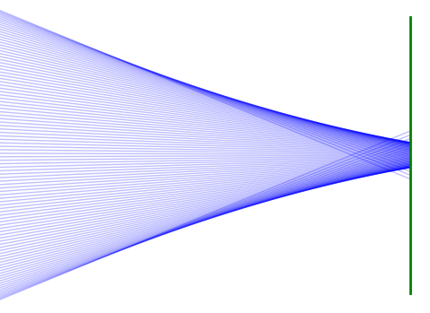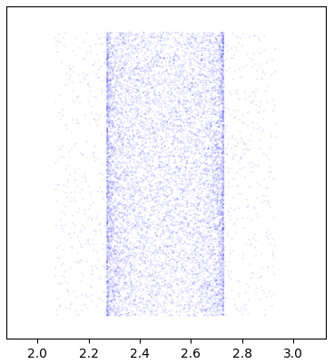
</p>

<i>Object initialisation:</i>
```
display_class.DisplayClass(p0, n0, length)
```

<i>Input parameters:</i>
* <b>p0</b> (np.array | default=np.array([0,0])) : Position of the display
* <b>n0</b> (np.array | default=np.array([-1,0])) : Orientation of the display
* <b>length</b> (float | default=10*mm) : Length of the display


#### Imager

An imager is a display with pixels of a finite width. If 'use phase information' is enabled, the phases of different rays coming together in a pixel will combine and result in an interfered intensity. When this option is disabled, all rays are presumed to have the same phase, and intensities are just added up.

<p align="center">
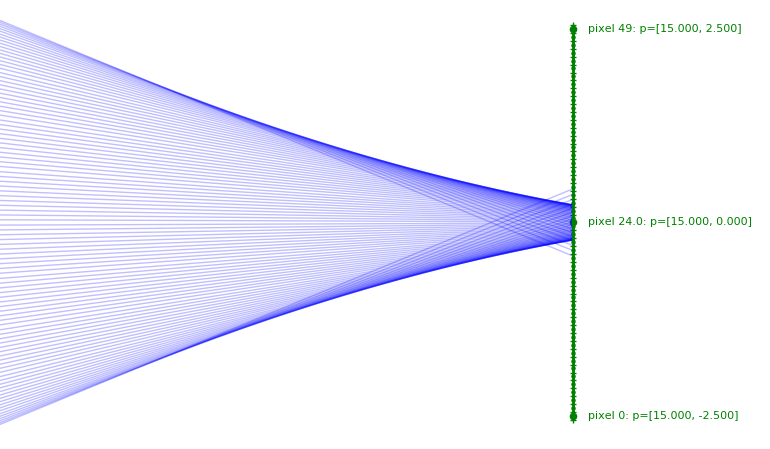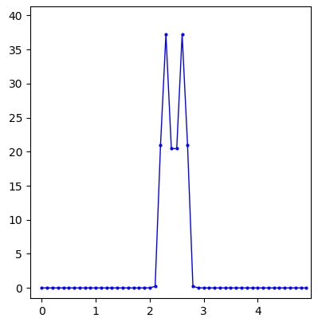
</p>

<i>Object initialisation:</i>
```
imager_class.ImagerClass(p0, n0, length, pixel_size)
```

<i>Input parameters:</i>
* <b>p0</b> (np.array | default=np.array([0,0])) : Position of the imager
* <b>n0</b> (np.array | default=np.array([-1,0])) : Orientation of the imager
* <b>length</b> (float | default=10*mm) : Length of the imager
* <b>pixel_size</b> (float | default=100*µm) : Pixel size of the imager. The number of pixels is determined by the length divided by the pixel size.

