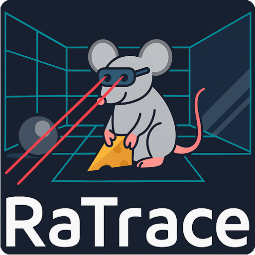
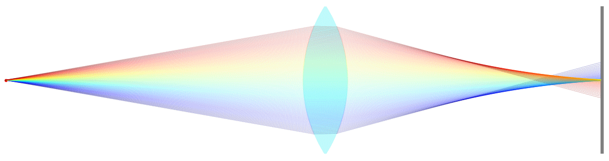

# RaTrace documentation

  

## Overview

  

<b>Implemented features</b>
* GUI for 2D raytracing
* Scene creation via Python scripts
* Simulation of static scenes, with or without UI
* Automated scripts for looped simulations with different scenes
* Exact raytracing for analytically described elements (spherical, parabolic, flat surfaces)
* Accurate raytracing for segments-based, more "complex" elements
* "Fast" raytrace mode for ordered elements or "slow" mode for full raytracing
* Wavelength dispersion
* Tracking of ray phase information
* Export ray information to a text file
* Color coding rays: wavelength, rainbow, fixed, intensity-scaling
* Support for:
  * Light sources: point source, diffusing plane source, parallel plane source, laser source, virtual rays, double coherent point source
  * Glass elements: spherical lens, ideal lens, glass slab,
  * Mirrors: flat, parabolic, semi-transparent
  * Surfaces: black absorber, diffuse scattering plane
  * Targets: display surface, imager

<b>To be implemented features</b>
* Lenses: plano-convex lens, aspherical lens
* Glass elements: prism, biprism, microlens array 
* Mirrors: spherical mirror
* Light source: B/W image source
* Internal & total reflections
* Better error handling when there is a bug in the scene
* Diffusely scattering sphere
* A library of glass materials
* Glass dispersion described with Abbe numbers
* Multi-node surfaces instead of simple lines
* Show a list of elements (properties) in the UI
* Edit elements in the UI itself

<b>Known bugs</b>
* First screenshot in looped gui does not set the axis correctly
* Warning concerning colors
* Contact surfaces (e.g. lens doublet) not working
* Crash when selecting an intensity plot in the display tab, when no imager is present 
* Many others ...

  

